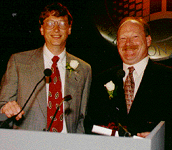

->**Free BASIC For All**<-
=======
->__——全民自由BASIC__<-
-----

->作者：bihai.org  <-

[toc]
# ->___前  言___<-  
----
## _书名解读_
+ **Free**:   
adj.    免费的; 自由的; 免税的; 空闲的;   
adv.    免费地; 自由地，无拘束地; 一帆风顺地;  
vt.     释放; 免除; 使自由; 解救;  
+ **BASIC**:   
abbr.   Beginners All-purpose Symbolic Instruction Code
BASIC 语言（初学者通用指令码）  
+ **For**:  
prep.   为，为了; 倾向于; 关于; 当作  
conj.   因为，由于  
+ **All**:  
adj.    全部的; 一切的; 各种的; 极度的，尽量的  
pron.   全部; 一切; 每个人，每件东西; 全部情况  
adv.    全部地; 完全地; 每个; 非常  
n.      全体; [常作A-]整体; [常与my, your, his, her等连用]（某人）所有的一切  

所以本书书名有5种含义：  
1. Free **BASIC**, for us all，我们所有人的自由**BASIC**  
2. Free **BASIC**, for all   platforms，所有平台的自由**BASIC**  
3. **Free** BASIC, for all.  为了所有人，所有平台，**自由化**BASIC  
4. Free and all **about** BASIC. **关于**BASIC的自由和所有的一切  
5. **Freedom** is the basic for all. **自由**乃万物基本  

聪明的读者，请随便挑几种理解吧，或者您有更好的解读，请不吝赐教。


## BASIC简史
### BASIC的诞生
1964年，美国达特茅斯大学的Thomas E. Kurtz(1928.2.22-)和John G. Kemeny (1926.5.31-1992.12.26，原籍匈牙利)，在Fortran II和ALGOL 60的基础上设计了一种新的计算机语言，命名为“Beginner's All-purpose Symbolic Instruction Code”， 意为初学者通用符号指令代码，简称BASIC。这个简单易学的计算机程序设计语言当时只有17条语句，12个函数和3个命令，这就是BASIC始祖——Dartmouth BASIC。 第一个BASIC程序(实际是一个编译器)于当地时间1964年5月1日凌晨4点在一台GE-265 (IBM 704) 主机中成功运行，操作者是Mike Busch和John McGeachie。从此Kurtz和Kemeny作为BASIC语言之父永载史册。  

|  ![Thomas E. Kurtz][1]   |   ![John G. Kemeny][2]   |
| :---: | :---: |
|  [Thomas E. Kurtz (1928.02.22-)][3]    |    [John G. Kemeny (1926.5.31-1992.12.26)][4]    |

  
BASIC语言本来是为校园的大学生们创造的高级语言，目的是使大学生容易使用计算机。虽然初期的BASIC语言功能弱、语句少，但由于BASIC比较容易学习，它很快从校园走向社会，成为初学者学习计算机程序设计的首选语言。  
BASIC语言自诞生起就显示出了强大的生命力，各种衍生版本层出不穷。从APPLE-Ⅱ机上用的APPLE SOFT BASIC，到LASER- 310上用的MSBASIC，到IBM-PC及其兼容机上用的BASICA和GW-BASIC，再到MS-DOS上的MS BASIC、QuickBASIC 和VisualBasic 1.0， 直至Windows下的Visual Basic和Linux下的XBasic、YaBASIC等等，BASIC无处不在，甚至 许多电子游戏机(例如小霸王学习机)和微型电子词典(例如文曲星)中都实现了BASIC。如今BASIC语言在许多国家都作为一种计算机程序的教学语言和入门语言。谭浩强教授八十 年代所著《BASIC语言》一书，曾经多次再版，现在的发行量已经超过千万之巨，BASIC语言在中国有着大量拥趸，许多编程爱好者和专业人士也一直对它情有独钟。 

### 早期BASIC

#### Dartmouth BASIC和True BASIC

|   ![dartmouth][5] |
|   :---:   |
|   达特茅斯大学John Kemeny(左)和Thomas Kurtz(中)与学生研究程序 |
BASIC创始人J.
Kemeny和T. Kurtz 1964年在达特茅斯大学使用的BASIC语言被称为Dartmouth
BASIC， 这个BASIC祖先经过七次以上的版本更新，到1983年时演变成了True BASIC。最早的True BASIC可以同时在IBM
PC和Apple Macintosh计算机上运行，既能以解释方式执行，也能将代码编译成机器语言从而提高运算速度。True
BASIC是一种真正的结构化程序设计语言，到今天已经发展出了DOS 、MacOS 、Windows
、Unix和Linux等各种操作系统下运行的多种版本，并提供了声音、图像、数学运算、多任务等丰富的功能库。True
BASIC现在仍然是一种有强大生命力的语言，可以访问<http://truebasic.com>来进一步了解这种古老而正宗的语言。

#### Tiny BASIC
[Li-Chen Wang][6]博士(1935－，美籍华人，中文名字王理瑱)在1970年代中叶发表了第一个真正用于微处理器的BASIC版本，可以运行于任何Intel 8080及Zilog
Z80 微处理器上， 需要2KB内存，使用纸带输入。最早版本Palo Alto Tiny BASIC于1976年5月发表在著名计算机杂志[Dr. Dobb'
s](http://en.wikipedia.org/wiki/Dr._Dobb's_Journal_of_Computer_Calisthenics_&_
Orthodontia)。值得关注的是，这段汇编程序开头一段写着：@COPYLEFT ALL WRONGS RESERVED"All Wrongs Reserved"和"CopyLeft"
字样。  

```x86asm
;*************************************************
;* 
;*                TINY BASIC FOR INTEL 8080
;*                      VERSION 1.0
;*                    BY LI-CHEN WANG
;*                     10 JUNE, 1976 
;*                       @COPYLEFT 
;*                  ALL WRONGS RESERVED
;* 
;*************************************************
```

####  Microsoft BASIC 
BASIC语言虽然不是微软发明的，但谁也无法否认微软在BASIC的发展过程中做出的努力和取得的成就。1975年3月2日，微软公司发布了第一个真正意义上的产品
：用于MITS Altair 8800――第一台商用个人计算机的BASIC编译程序，从而开始了微软的传奇之旅。这个BASIC产品也为比尔・盖茨和保罗・艾伦的微软帝国奠定了基础，这也是比尔・盖茨对BASIC情有独钟的原因之一。 具有讽刺意味的是， 这个纸带上的著名产品本身也成了个人微型计算机历史上第一次大规模盗版的牺牲品——因为一份拷贝在正式发布前的一次展示会上丢失了，于是产生了大量复制品，这甚至影响到微软的产品策略，导致BASIC最终被免费随MS-DOS提供给用户。 这也是微软历史上第一次源代码泄漏事件。

|  ![enter description here][7]  |   ![enter description here][8]  |
| :---: | :---: |
|  最初的微软公司，摄于1978年12月 左下角是比尔・盖茨，右下角是保罗・艾伦   |    纸带上的MS BASIC 1.0   |

#### BASIC 解释器： 
IBM发布的第一台PC机的ROM中包含了一个BASIC，而且它使用的由微软公司编写的PC- DOS里包含了一个扩展的磁盘版的BASIC，名为BASICA(高级BASIC)，而微软自己的MS-DOS则包含了一个类似的版本，称为GW-BASIC 。BASICA和GW-BASIC的区别在于BASIC 需要计算机内建ROM BASIC的支持。使用Basica/MS Basic/IBM Basic的IBM-PC如果没有启动软盘，ROM BASIC就会自动运行。  
BASICA和GW-BASIC都是解释器，解释器相对容易实现而且不需要为结果代码保留内存，但与编译后的程序相比速度较慢。  
```basic
10 color 14
20 print "Welcome to http://bihai.org"
```

|  ![gw-basic][9]  |
|   :---:  |
|  GW BASIC 3.23 运行实例  |


|   ![Laser][10] | ![apple ii][11] |
|   :---:  |  :---:  |  
|   Laser 310，香港制造，1984年开始生产，CPU: Zilog Z80 A，速度3.54 MHz，内存16-64KB，带电视和视频接口，操作系统MS BASIC，1985年价格为257美元。    |   Apple II，美国制造，1983年开始生产，CPU: MOS 65c02，速度1.02 MHz，内存64KB，操作系统DOS 3.3 or ProDOS，1298美元。|
### 微软的BASIC编译器
#### Microsoft QuickBASIC
Basic解释器的优点显而易见，缺点也是一目了然：速度慢，不易重复使用。MS Basic 编译器于1982年开始随磁盘提供，一直发展到5.0版。这个编译器后来改名MS QuickBASIC 1.0(这可不是后来的QBASIC1.0)，并一直迭代到PDS 7.1。    
其间1991年Microsoft 发布MS-DOS 5.0时，将QuickBASIC编辑器从编译系统中提取出来，只保留p-code解释器，因此它比QuickBASIC的QB.EXE要慢一些。由于加入了“/EDITOR”命令行选项，QBasic可以同时充当全屏文本编辑器，作为QBASIC1.0同MS-DOS 5.0一起发布。为了简化操作，微软制作了一个小程序EDIT.COM使用/EDITOR选项调用QBASIC，这个组合替换了GW-BASIC和EDLIN。
有人称QBasic 1.X作"QuickBASIC 5"， 或许是因为运行库为5.0，或许因为最初同MS-DOS 5.0 一起发布，谁知道呢？

|    |
|   :---:   |
|   比尔・盖茨和艾伦・库珀――Visual BASIC之父 |
#### Microsoft Visual Basic
当微软和IBM在OS/2问题上分道扬镳后，微软丢弃了Windows 2.x，开始严肃的重写Windows 3.0。微软需要一种Windows的编程语言，因为不是所有人都可以用c语言摆平Windows API开发。Alan Cooper，当他使用C来编写Windows
3.0下的外壳软件――Ruby时，怎么也不会想到自己会成为令人激动、喜爱、强大和热门的Visual BASIC的创始人。然而最不可思议的是这个事实,Visual BASIC的确是一个副产品。更确切地说，它是QuickBASIC语法特性、编译功能和Alan
Cooper的可视化开发环境的一次革命性的结合。1991年微软公司展示的叫作Thunder的工具，让所有的开发者都惊呆了，人们居然可以用鼠标“画”出所需的用户界面，然后用简单的BASIC语言编写代码生成一个Windows应用程序。这个产品最终被定名为Visual BASIC，采用事件驱动，Quick BASIC的语法和可视化的IDE。Visual Basic 1.0 for Windows
同DOS版一起发布。需要Windows 3.0以上，80286或以上处理器，1MB内存，软盘驱动器和硬盘，支持CGA, EGA, VGA, 8514/A,
Hercules 或兼容显示卡，鼠标，零售价199美元。
#### Microsoft Visual Basic 6.0

|  ![vb6][12] |
|   :---:  |
|  Visual Basic 6.0 套装  |

Visual Basic 6.0作为Visual Studio 6.0的一员发布，也被称作Visual Basic 98。Visual Basic 6.0在数据访问方面有了很大的改进，新的ADO组件让对大量数据快速访问成为可能。数据环境和新的报表功能也让数据开发有了全新的体验。Visual Basic 借助COM/COM+强大的功能，可以开发具有N层结构的分布式应用程序。同时，Visual Basic 6还可以在IIS上开发性能超群的Web应用程序。Visual Basic 6.0在语言方面和IDE方面的改进都不大，但是许多新增的组件成为Visual Basic开发人员手中的利器，如File System Object等。新的字符串函数Split和Replace等也给Visual Basic的程序员带来很大方便。总之Visual Basic 6.0已经是非常成熟稳定的开发系统，能让企业快速建立多层的系统以及Web应用程序，成为当时Windows上最流行的Visual Basic版本之一。

#### Microsoft Visual Basic .NET
VB6到VB.NET的跳跃如此之大，使得Visual Basic阵营一度分化，一时间充满了质疑和反对的声音，但是微软丝毫不为所动。Visual Basic.NET有对CLR最完善的支持， 同时尽量保留着BASIC易懂的语法风格和易用性。现在作为.NET工具集内强有力的一员，Visual Basic .NET正在扮演着重要的角色。

### BASIC用作脚本语言
#### VBScript/ASP/ASP.NET: 应用广泛的脚本语言
VBScript是“Microsoft's Visual Basic Scripting Edition”的缩写，是[Visual Basic](http://en.wikipedia.org/wiki/Visual_Basic) 的子集，主要作为广泛应用的脚本语言用于ASP网页和[Windows](http://en.wikipedia.org/wiki/Windows_Scripting_Host)脚本执行，有时也用来替代DOS批处理文
件。VBScript依赖于脚本解释程序, 不论是网页环境里的ASP、WINDOWS环境里的wscript.exe还是命令行方式下的cscript.exe。VBscript文件通常使用"vbs"作为扩展名。  
MS [ Internet Explorer](http://en.wikipedia.org/wiki/Internet_Explorer) 中使用的VBScript版本非常接近[JavaScript](http://en.wikipedia.org/wiki/JavaScript)[，](http://en.wikipedia.org/wiki/JavaScript)可以嵌入HTML。然而由于它对其他浏览器而言实际上没有一点兼容性，许多网站站长更喜欢（实际
是不得不）选择[JavaScript](http://en.wikipedia.org/wiki/JavaScript)。
+ VBA: 使你的工作自动化
Visual Basic for Applications (VBA) 是Microsoft Office应用软件内建的BASIC语言实现。越来越多的软件开始支持VBA，例如AutoCAD、WordPerfect、CorelDRAW和Visio、Open Office等等。它扩充了以前的宏语言(例如WordBASIC)，并且能够用来控制宿主程序的所有的一切，比如菜单修改和加入用户自定义的对话框和控件。正如其名，VBA是Visual Basic的近亲，但通常只能运行于宿主程序内部，而不是单独执行。你可以用它来从外部控制程序的执行，例如自动根据Excel的数据生成Word文档。除了回调以外，VBA基本与Visual Basic最新版本同步，而且使用Visual Basic中的运行库。
### BASIC大家庭: 我们的朋友遍天下
#### Turbo BASIC/Power BASIC: 独辟蹊径
Borland在推出著名的Turbo C后不久的1987年推出了自己的BASIC编译器――TurboBASIC 1.0。正如 BORLAND
的一贯风格，这个版本丝毫不逊色于它的微软表兄QuickBASIC,而且在某些方面还独具特色。1988年，新的TurboBASIC 4.0推出，支持多文档界面，各方面也有长足进步。然而从此以后，Borland似乎与微软达成了某种默契，突然离开了BASIC领域，转而发展PASCAL语言。于是在1990年，Bob Zale――Turbo Basic和PowerBASIC
之父，最终收回了自己的产品，并独立将其发展为现代的PowerBASIC。
#### REALbasic/PureBasic : 跨平台的选择
商业软件，跨平台是主打特色，一次编写，即可发布运行在Windows、Linux、Mac OS X等主流平台，省时省力省钱的选择。
#### FreeBASIC：真正的黑马

|  ![enter description here][13] |
|   :---:  |
| FreeBASIC黑马LOGO |
终于说到重点了，本书要用到的主要工具之一，就是FreeBASIC。
网站上作者的自我定位是：
FreeBASIC is a free/open source (GPL), BASIC compiler for Microsoft Windows, DOS and Linux.
（FreeBASIC是免费/开源(GPL)的BASIC编译器，支持Microsoft Windows, DOS 和 Linux），现在看来已经太谦虚了。
由于[FreeBASIC网站][14]使用一匹黑马作为LOGO，恰巧也点出了其特色。
    1. 学习过 QuickBASIC 的用户就可以上手，兼容绝大部分QuickBASIC语法，添加了许多新特性；
    2. 完全免费开源<https://github.com/freebasic/>，能够编译产生高品质的机器码，支持32位、64位操作系统，跨平台支持DOS, Windows, Android, Linux和Mac OS X(同人作品);
    3. 支持调用emscripten编译生成javascript，理论上讲可以跨所有平台；
    4. 由V1ctor启动，团队开发多年，社区成熟热情，还在继续成长。

### 小结
BASIC版本还有很多很多，我就先说到这里罢，你我的脑子都够累了。我想你现在应该感觉到BASIC的力量了罢？现在就跳到下一章开始学习BASIC编程罢，即使你从来没有接触过计算机，BASIC语言也能使你用最短的时间成为一个真正的程序员。在将来，BASIC也许无处不在。即使不用计算机，使用BAS
IC语言逻辑来协助你的日常工作和生活，不也是一大乐事吗？


  [1]: ./images/Fearless_Leader.gif "Fearless_Leader.gif"
  [2]: ./images/Kemeny.jpeg "Kemeny.jpeg"
  [3]: https://en.wikipedia.org/wiki/Thomas_E._Kurtz
  [4]: https://en.wikipedia.org/wiki/John_G._Kemeny
  [5]: ./images/kemenyandkurtz.jpg "kemenyandkurtz.jpg"
  [6]: https://en.wikipedia.org/wiki/Li-Chen_Wang
  [7]: ./images/ms.jpg "ms.jpg"
  [8]: ./images/basic1.0s.gif "basic1.0s.gif"
  [9]: ./images/gb-basic.jpg "gb-basic.jpg"
  [10]: ./images/laser.jpg "laser.jpg"
  [11]: ./images/appleii.jpg "appleii.jpg"
  [12]: ./images/vb6s1.jpg "vb6s1.jpg"
  [13]: ./images/298124.png "298124.png"
  [14]: http://freebasic.net