## BASIC万花筒  
                        ――你所熟悉和陌生的BASIC

by [bihai](mailto:bihaiorg@139.com) from http://www.bihai.org

你知道吗？BASIC四十岁了。  
经常有网友问：要学编程，应该从哪种语言入手？作为一个热爱了BASIC 20年的人， 我会毫不犹豫的告诉你：当然是BASIC。
不管你过去对BASIC有何偏见和误解，你现在将对它有一个重新审视的机会。

### BASIC的诞生――一个传奇的开始

1964年，美国达特茅斯大学的Thomas E. Kurtz(1928- )和John G.
Kemeny(1926.5.31-1992.12.26,原籍匈牙利)在Fortran II和ALGOL
60的基础上设计了一种新的计算机语言，命名为“Beginner's All-purpose Symbolic Instruction Code”，意为初学者
通用符号指令代码，简称BASIC。这个简单易学的计算机程序设计语言当时只有17条语句，12个函数和3个命令，这就是BASIC始祖――Dartmouth
BASIC。第一个BASIC程序(实际是一个编译器)于当地时间1964年5月1日凌晨4点在一台GE-265 ([IBM
704](images/ibm704.gif)) 主机中成功运行，操作者是Mike Busch和John
McGeachie。从此Kurtz和Kemeny作为BASIC语言之父被永远载入史册。

Thomas E. Kurtz

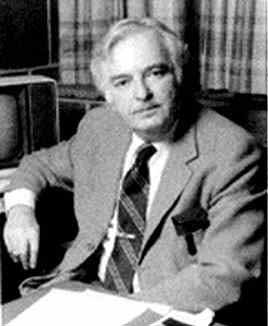

John G. Kemeny(1926.5.31-1992.12.26)

BASIC语言自诞生起就显示出了强大的生命力，各种版本层出不穷。从APPLE-Ⅱ机上用的APPLE SOFT BASIC，到LASER-
310上用的MSBASIC，到IBM-PC及其兼容机上用的BASICA和GW-BASIC，再到MS-DOS上的MS BASIC、QuickBASIC
和VisualBasic 1.0， 直至Windows下的Visual Basic和Linux下的XBasic、YaBASIC等等，BASIC无处不在，甚至
许多电子游戏机(例如小霸王学习机)和微型电子词典(例如文曲星)中都实现了BASIC。从诞生之初，BASIC语言就以其简单、易学和对硬件要求低等特点受到了广大
程序设计人员，特别是电脑初学者的青睐，历经四十载，显示了其顽强的生命力。如今BASIC语言在许多国家都作为一种计算机程序的教学语言和入门语言。谭浩强教授八十
年代所著《BASIC语言》一书，曾经多次再版，现在的发行量已经超过千万之巨，BASIC语言在中国有着大量拥趸，许多编程爱好者和专业人士也一直对它情有独钟。  

### 早期的BASIC

###  Dartmouth BASIC和True BASIC

我不想在这里详细回顾计算机的发展史，因为那是另一项大工程，但地球人都直道，计算机是从电子管到晶体管
进化到集成电路到大规模集成电路到超大规模集成电路，从大型机到小型机再到微型计算机的。BASIC也是伴随着这个进化而演变的。BASIC创始人J.
Kemeny和T. Kurtz 1964年在Dartmouth学院使用的BASIC语言被称为Dartmouth
BASIC，这个BASIC祖先经过七次以上的版本更新，到1983年时演变成了True BASIC。最早的True BASIC可以同时在IBM
PC和Apple Macintosh计算机上运行，既能以解释方式执行，也能将代码编译成机器语言从而提高运算速度。True
BASIC是一种真正的结构化程序设计语言，到今天已经发展出了DOS 、MacOS 、Windows
、Unix和Linux等各种操作系统下运行的多种版本，并提供了声音、图像、数学运算、多任务等丰富的功能库。True
BASIC现在仍然是一种有强大生命力的语言，可以访问<http://truebasic.com>来进一步了解这种古老而正宗的语言。

** 下载 Dartmouth BASIC -Just a joke.;-)**

[ **下载 True BASIC 2.0 for
DOS**](http://bihai.org/mydoc/msbasic/truebasic20.zip)

** [ 下载 True BASIC Gold For Windows Demo](http://bihai.org/mydoc/msbasic/BrTruebasic.exe)**

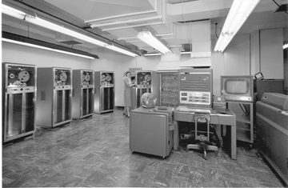

IBM-704大型计算机

###  Tiny BASIC

Li-Chen Wang博士(华裔？)在二十世纪70年代中叶发表了第一个真正用于微处理器的BASIC版本，可以运行于任何Intel 8080及Zilog
Z80 微处理器上， 需要2KB内存，使用纸带输入。最早版本Palo Alto Tiny BASIC于1976年5月发表在著名计算机杂志[Dr. Dobb'
s](http://en.wikipedia.org/wiki/Dr._Dobb's_Journal_of_Computer_Calisthenics_&_
Orthodontia)。这是个自由版本，源代码中含有"All Wrongs Reserved"和"CopyLeft"
字样，表现出作者对金钱的不屑――致敬！

[ ** 下载 Tiny BASIC for 808x**](http://bihai.org/mydoc/msbasic/tinibasic.zip)

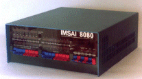  
一台真正的8080计算机

### Microsoft BASIC

### PC上的第一个BASIC――一个里程碑

BASIC语言虽然不是微软发明的，但谁也无法否认微软在BASIC的发展过程中做出的努力和取得的成就。1975年3月2日，微软公司发布了第一个真正意义上的产品
：用于MITS Altair 8800――第一台商用个人计算机的BASIC编译程序，从而开始了微软的传奇之旅。MITS Altair 8800的寿命非常短暂
，但却开创了一个历史。这个BASIC产品也为比尔・盖茨和保罗・艾伦的微软帝国奠定了基础，同样，这也是比尔・盖茨对BASIC情有独钟的原因之一。
记住这两个名字罢：比尔・盖茨(Bill Gates)保罗・艾伦(Paul Allen),正是他们创造了PC平台的BASIC和后来的微软神话。 具有讽刺意味的
是，这个纸带上的著名产品本身也成了个人微型计算机历史上第一次大规模盗版的牺牲品――因为一份拷贝在正式发布前的一次展示会上丢失了，于是产生了大量复制品，这甚至
影响到微软的产品策略，导致BASIC最终被免费随MS-DOS提供给用户。 这也是微软历史上第一次源代码泄漏事件;-)。

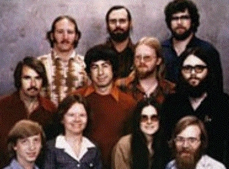

最初的微软公司  
摄于1978年12月  
左下角是比尔・盖茨，右下角是保罗・艾伦

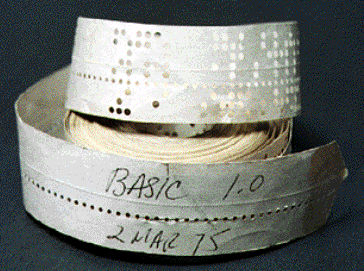

纸带上的MS BASIC 1.0

### Basic 解释器：

IBM发布的第一台PC机的ROM中包含了一个BASIC，而且它使用的由微软公司编写的PC-
DOS里包含了一个扩展的磁盘版的BASIC，名为BASICA(高级BASIC)，而微软自己的MS-DOS则包含了一个类似的版本，称为GW-BASIC
。BASICA和GW-BASIC的区别在于BASIC 需要计算机内建ROM BASIC的支持。使用Basica/MS Basic/IBM
Basic的IBM-PC如果没有启动软盘，ROM BASIC就会自动运行。

BASICA和GW-BASIC都是解释器，解释器相对容易实现而且不需要为结果代码保留内存，但与编译后的程序相比速度较慢。

**[下载 MS Basic 5.28](http://bihai.org/mydoc/msbasic/Msbasic.zip) **(1977-1983)  
  古老的MSDOS (1983)中所带的MS BASIC。  
**[ 下载 IBM PC Basic A2.10](http://bihai.org/mydoc/msbasic/ibmPcBasicA210.zip)  
[下载 IBM Basica 3.0 vers. 1](http://bihai.org/mydoc/msbasic/basica30.zip)**  
**[ 下载 GW-BASIC 2.01](http://bihai.org/mydoc/msbasic/GW-BASIC201.zip)** (西班牙语版)   
**[ 下载 GW-BASIC 2.02](http://bihai.org/mydoc/msbasic/GW-BASIC202.zip)**   
**[ 下载 GW-BASIC 3.20](http://bihai.org/mydoc/msbasic/GW-BASIC320.zip)**   
**[ 下载 GW-BASIC 3.22](http://bihai.org/mydoc/msbasic/GW-BASIC322.zip)**   
**[ 下载 GW-BASIC 3.23](http://bihai.org/mydoc/msbasic/GW-BASIC323.zip)**   

GW-BASIC 2.0包装盒

**[ 下载 GW-BASIC 语言手册](http://bihai.org/mydoc/msbasic/GW-BASIC-reference.zip)**

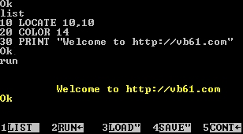

GW-BASIC 3.23运行屏幕

80年代中后期开始接触个人电脑的人大多对上面这几个版本非常熟悉，而且他们中有很多人对APPLE II、LASER
310和所谓“中华学习机（其实是一种OEM的APPLE II）”中的BASIC印象深刻，估计也大都可以随意写几行代码来显示一个圆圈，或是几条曲线。
当时国内曾经举办过编程大赛，影响颇大。不才鄙人区区在下笔者我也是在这个BASIC的吸引下开始热爱编程直至今日的。
可惜我怎么也找不到当年这些BASIC的身影，如果您有，请不吝赐予。

Laser 310，我的启蒙计算机，香港制造，1984年开始生产，CPU: Zilog Z80 A，速度3.54
MHz，内存16-64KB，带电视和视频接口，操作系统MS BASIC，1985年价格为257美元。

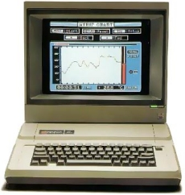

Apple II，美国制造，1983年开始生产，CPU: MOS 65c02，速度1.02 MHz，内存64KB，操作系统DOS 3.3 or
ProDOS，1298美元。

###  Basic 编译器：

Microsoft QuickBASIC 1.0：

Basic解释器的优点显而易见，缺点也是一目了然：速度慢，不易重复使用。MS Basic 编译器于1982年开始随
磁盘提供，一直发展到5.0版。这个编译器后来改名MS QuickBASIC 1.0(这可不是后来的QBASIC1.0)。它只是使用GW-
BASIC类似语言的命令行版本，要求256K内存，DOS 2.0以上，需要双面磁盘驱动器。

**[ 下载 MS Basic Compiler 1.0](http://bihai.org/mydoc/msbasic/bascom.zip)  
[下载 MS Basic Compiler 2.0](http://bihai.org/mydoc/msbasic/bascom2.zip)**

Microsoft QuickBASIC 2.XX：

QB2.00 - 5.25"磁盘版发布于1986.9.29，3.5"磁盘版发布于1986.8.15，增加了下面的特色：内建编辑器，动态数组、多行IF..TH
EN..ELSE..ENDIF语句，EGA 显示卡支持，BLOAD/BSAVE 语句。QB2.01 - 5.25"磁盘版发布于1987.1.20,
3.5"磁盘版发布于1987.2.2，纠正了几个2.00版的错误，增加了对IBM扩展键盘的支持。

**[ 下载 MS QuickBASIC 2.00](http://bihai.org/mydoc/msbasic/qb20.zip)                     [ 下载 MS QuickBASIC 2.01](http://bihai.org/mydoc/msbasic/qb201.zip)**

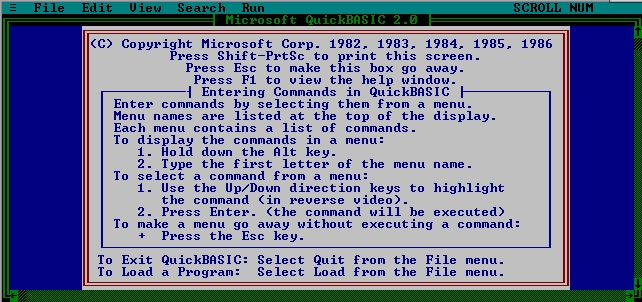

运行中的QuickBASIC 2.0

QuickBASIC 2.0

Microsoft QuickBASIC 3.0：

QuickBASIC 3.0 - 5.25"磁盘版发布于1987.04.13.
3.5"磁盘版发布于1987.4.13，使用两张720K软盘，说明书595页。 需要320K内存和DOS 2.0 以上操作系统，完全兼容BASICA/GW-
BASIC。包括了QB.EXE和QB87.EXE，既有解释器又有编译器，QB87.EXE支持数学协处理器。编辑器比较2.XX有长足进步。加入SELECT
CASE, DO LOOP, CONST等等。

**[ 下载 MS QuickBASIC 3.00](http://bihai.org/mydoc/msbasic/qb30.zip)**

**[ 下载 ](http://bihai.org/mydoc/msbasic/qb30-reference.zip)** **[ QB 3.0 参考手册**](http://bihai.org/mydoc/msbasic/qb30-reference.zip)

Microsoft QuickBASIC 4.0：

**QB4.00** \- 5.25"磁盘版发布于1987.04.13. 3.5"磁盘版发布于1987.10.10。引入线性P-CODE技术，每行输入都执行错误检查，编辑器内立即执行。编辑器允许多个模块同时装载，增加如下特色：Hercules 显示卡支持，递归，自定义类型(TYPE...END TYPE)，巨型动态数组(大于64K)，定长字符串，高级语言调用(Microsoft C, FORTRAN, Pascal)，增强的调试器，兼容MS CodeView，Basic 语法在线帮助，QB4.0无疑是一个里程碑，许多程序员非常喜欢它，对于它的参考手册甚至比对后来版本更加喜欢，因为它更加详细。 

QB4.00a和4.00b发布于1988年，用来修正4.0中的错误。

**[ 下载 MS QuickBASIC 4.0](http://bihai.org/mydoc/msbasic/qb40.zip)**

QB 4.0 包装盒

Microsoft QuickBASIC 4.5：

**QB4.5** \- 5.25"磁盘版和3.5" 720K磁盘版 (3碟)发布于1988.10.21，有一个720K磁盘版标注日期1990年，但并非新版。新的用户界面，完整的上下文帮助 包含了所有语言参考手册，在线帮助系统包含有可以复制粘贴到程序中的例程，需要384K内存，DOS 2.1以上操作系统。4.5版含有再 线帮助，但仍是对4.00b主要版本的错误修正版。 

**[ 下载 MS QuickBASIC 4.5](http://bihai.org/mydoc/msbasic/qb45.zip)** [包括示例的完整版本]  
**[ 下载 MS QuickBASIC 4.5](http://bihai.org/mydoc/msbasic/qb45_Setup.zip)** [原盘的完整版本]  
**[下载 MS QuickBASIC 4.5 (德语版)](http://bihai.org/mydoc/msbasic/qb45ger.zip)**

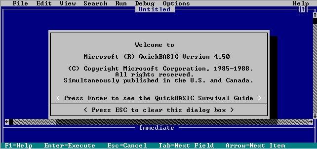

运行中的QuickBASIC 4.5

QB 4.5 包装盒

Microsoft QBasic 1.XX：

1991年时，DOS 仍旧是个人电脑主要的操作系统，Microsoft 发布了MS-DOS
5.0。许多年了，微软一直受到对于edlin编辑器的批评，而edlin已经在DOS中存在了多年没有变化。而对于GW-
BASIC同样有此抱怨。微软为此将QuickBASIC编辑器从编译系统中提取出来，只保留p-code解释器，因此它比QuickBASIC的QB.EXE要慢一
些。由于加入了“/EDITOR”命令行选项，QBasic可以同时充当全屏文本编辑器，作为QBASIC1.0同MS-DOS
5.0一起发布。为了简化操作，微软制作了一个小程序EDIT.COM使用/EDITOR选项调用QBASIC，这个组合替换了GW-BASIC和EDLIN
。当1993年MS-DOS 6.0发布时，QBasic1.1版包含在所有MS-DOS6.XX及WIN9X中(请参考WIN9X光盘
目录\tools\oldmsdos\\)。

有人称QBasic 1.X作"QuickBASIC 5"，或许是因为运行库为5.0，或许因为最初同MS-DOS5一起发布，谁知道呢？

**[下载 MS Qbasic 1.0](http://bihai.org/mydoc/msbasic/qbasic10.zip)**

**[ 下载 MS Qbasic 1.0 (西班牙语版)](http://bihai.org/mydoc/msbasic/qbasic10sp.zip)**

**[ 下载 MS Qbasic 1.0 (意大利语版)](http://bihai.org/mydoc/msbasic/qbasic10ital.zip)**

**[下载 MS Qbasic 1.1](http://bihai.org/mydoc/msbasic/qbasic11.zip)**

**[ 下载 MS Qbasic 1.1 (德语版)](http://bihai.org/mydoc/msbasic/qbasic11ger.zip)**

**[ 下载 MS Qbasic 1.1 (瑞典语版)](http://bihai.org/mydoc/msbasic/qbasic11swe.zip)**

**[ 下载 MS Qbasic 1.1 源代码――这可是QBASIC本身的源代码，绝非示例！](http://bihai.org/mydoc/msbasic/qbasic11src.zip)**

Microsoft Basic 编译器 6.00：

微软公司回到了先前的版本号。这个版本同时支持OS/2 1.0和MS-DOS 2.1，可惜没有迹象表明这个版本公开发布过。

Microsoft Basic 编译器 7.XX：

**MS BASIC 7.00**: Microsoft BASIC 专业版开发系统 7.0版 (1989)，使用12张360K的5.25"软盘，或6张3.5"软盘。7.0和7.1版的用户手册基本没有变化。 

**[下载 MS Basic PDS 7.0](http://bihai.org/mydoc/msbasic/basic7.zip)**

** MS BASIC 7.1**:  Microsoft BASIC 专业版开发系统 7.1版，包括8张720K软盘或5张1.2MB软盘，发布日期1990.6.24，包含了MS CodeView 3.14 for DOS。  

**[ 下载 MS Basic PDS 7.1](http://bihai.org/mydoc/msbasic/BC7.zip)**

**[ 下载 MS Basic PDS 7.1](http://bihai.org/mydoc/msbasic/pds71.zip)** (原盘的完整版本)

PDS 7.1 包装盒

### Microsoft Visual Basic――又一个里程碑

_ 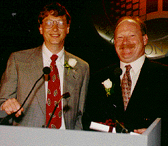_

比尔・盖茨和艾伦・库珀――VB之父

** Microsoft Visual Basic 1.0 for Windows：**  

当微软和IBM在OS/2问题上分道扬镳后，微软丢弃了Windows 2.x，开始严肃的重写Windows
3.0。微软需要一种Windows的编程语言，因为不是所有人都可以用c语言摆平Windows API开发。Alan
Cooper，这个胖乎乎的老头，一看就比别人聪明。当他使用C来编写Windows
3.0下的外壳软件――Ruby时，怎么也不会想到自己会成为最令人激动、喜爱、强大和热门的Visual BASIC的创始人。然而最不可思议的是这个事实――虽然
许多人不能接受――vb的确是一个副产品。更确切地说，它是比尔・盖茨的QuickBASIC语法特性、编译功能和Alan
Cooper的可视化开发环境的一次革命性的结合。1991年微软公司展示的叫作Thunder的工具，让所有的开发者都惊呆了，
人们居然可以用鼠标“画”出所需的用户界面，然后用简单的BASIC语言编写代码生成一个Windows应用程序。这个产品最终被定名为Visual
Basic，采用事件驱动，Quick BASIC的语法和可视化的IDE。Visual Basic 1.0 for Windows
同DOS版一起发布。需要Windows 3.0以上，80286或以上处理器，1MB内存，软盘驱动器和硬盘，支持CGA, EGA, VGA, 8514/A,
Hercules 或兼容显示卡，鼠标，零售价199美元。

 **[下载 Visual Basic 1.0 for Windows](http://bihai.org/mydoc/msbasic/vb1.zip)**

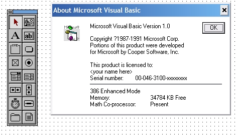

运行中的vb1.0 for Windows

VB 1.0 FOR WINDOWS 包装盒

**Microsoft Visual Basic 1.0 for MSDOS：**

1991年微软同时发布了Visual Basic for DOS和Visual Basic for Windows。VB DOS
提供的不仅仅是一个QuickBASIC兼容平台，还是一个字符基础上的事件驱动的Windows程序。相对VB Windows 的日新月异，VB DOS
从来没有被增强过，因为微软决定尽快抛弃DOS平台。VB DOS只是用来诱使QuickBASIC适应Windows 编程的鱼饵。 Visual Basic
for DOS 专业版，微软产品代号203-099V100，7张1.44MB或9张1.2MB软盘。

**[ 下载 MS VBDOS 1.0 (标准版)](http://bihai.org/mydoc/msbasic/VBDOS.zip)**

**[ 下载 MS VBDOS 1.0 (专业版)](http://bihai.org/mydoc/msbasic/vbd100p.zip)** (原盘的完整版本)  

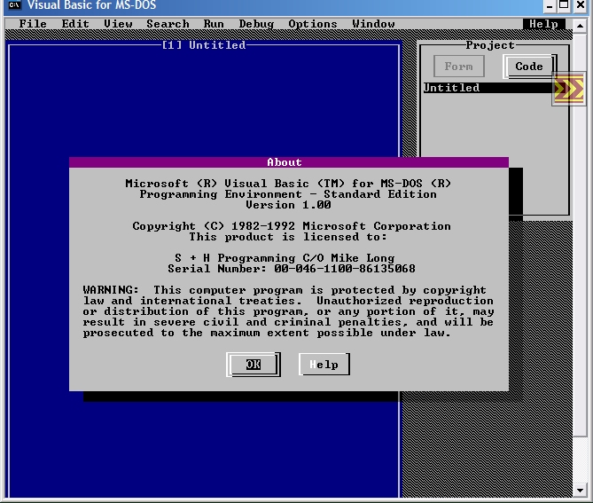

运行中的vb1.0 for DOS

VB 1.0 FOR DOS 包装盒

**Microsoft Visual Basic 2.0**

由于Windows 3.1的推出，Windows已经充分获得了用户的认可，Windows开发也进入一个新的时代。Visual Basic
1.0的功能过于简单，相对于Windows 3.1的强大功能没有发挥出来。 于是，微软在1992年推出了新版本Visual Basic 2.0。这个版本最大
的改进就是加入了对象型变量，一般类型的变量可以引用专有类型的实例，甚至通过后期绑定访问专有类型的属性和方法。还可以通过TypeOf…Is运算符获取对象实例的
运行时类型信息。除了对语言的改进和扩充，Visual Basic 2.0对VBX有了更好的支持，许多第三方控件涌现出来，极大地丰富了Visual
Basic的功能。微软还为Visual Basic 2.0增加了OLE和简单的数据访问功能。

**[ 下载 Visual Basic 2.0 for Windows](http://bihai.org/mydoc/msbasic/vb2.zip)**

VB 2.0 包装盒

**Microsoft Visual Basic 3.0**  

1993 年， Microsoft 发布了 Visual Basic 3.0 。这无疑是最成功的版本之一。这一版本的 Visual Basic 支持
ODBC 、 OLE 等高级特性。 Grid控件和数据控件能够创建出色的数据窗口应用程序，而Jet引擎让Visual
Basic能对最新的Access数据库快速地访问。Visual Basic
3.0还增加了许多新的金融函数。此外还增加了相当多的专业级控件，可以开发出相当水平的Windows应用程序。Visual Basic
3.0是98年以前中国最流行的Visual Basic版本，因为它开发出来的可执行文件非常小，通常能用一张软盘装下。不过，Visual
Basic采用虚拟机运行P代码的做法也让很多开发者不满，他们认为这样程序运行的效率很低，而且使用特别的工具可以轻易将其反编译。Visual Basic
3.0 标准版需要Windows 3.0以上，2MB
可用内存，一个高密度磁盘驱动器，12MB硬盘空间，EGA以上显示器，鼠标，包括3张1.44MB磁盘。Visual Basic 3.0
专业版，9张1.44MB软盘。

**[ 下载 Visual Basic 3.0 标准版](http://bihai.org/mydoc/msbasic/vb30.zip)**

**[ 下载 Visual Basic 3.0 专业版](http://bihai.org/mydoc/msbasic/Vb3pro_Setup.zip)** (10MB)  

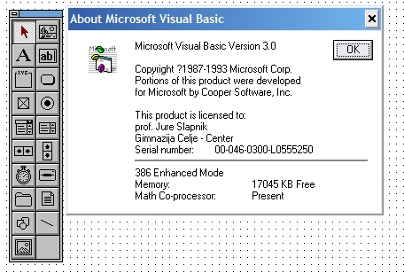

运行中的 VB 3.0

VB 3.0 包装盒

**Microsoft Visual Basic 4.0**

1995 年发布的 Visual Basic 4.0 不但支持 Windows 95 系统下 32 位应用程序开发，而且为 Visual Basic
引入了类（ Class ）等面向对象概念。 这个版本包含了16位和32位两个版本，16位的版本就像是Visual Basic
3.0的升级版，而32位版则是一场新的革命。首先，VBX控件不见了，换成了OCX控件，用现在的话说，它就是COM控件。第二个最大变化是Visual
Basic 4.0所用的语言换成了Visual Basic For Application，这就和Office
95所采用的宏语言统一起来，这个新语言有很多亮点：  
1、 加入了“类模块”。这是面向对象最重要的封装性的基础。  
2、 加入了属性过程，加上函数过程，子程序过程，VB已经有组件开发所需的封装性特征。  
3、 加入了Byte类型、Boolean类型和Object类型。这大大完善了VB的类型系统。  
4、For Each语句和Collection对象。For Each语句给遍历集合类型提供了极大的方便，现在可以在动态增长的Collection上使用For
Each，而不用担心集合内容的总数或烦人的下标问题。  
这个版本的Visual Basic还能够开发DLL工程，其实就是COM的DLL，可以将书写好的类用这种方式和其他语言共享。  
总之，这个4.0的版本为Visual Basic成为一种COM语言奠定了基础。用Visual Basic
4.0开发基于COM的DLL比任何一种开发工具都方便。但是，Visual Basic 4.0的性能问题变得更加严重了，P-代码的组件成为Visual
Basic 4.0严重的性能瓶颈，而且巨大的运行库也让用户感到不满。Visual Basic
4.0对以前版本的支持也不好，使用了大量VBX的项目很难移植到Visual Basic 4.0中。因此，Visual Basic
4.0在中国的普及程度非常低。  
Visual Basic 4.0于1995年发布，18张3.5"软盘或CDROM。两个版本：Windows 3.1下的16位版本和Windows 3.1 +
win32s或 or Windows 9X下的32位版本。

**[ 下载 Visual Basic 4.0 Professional](http://bihai.org/mydoc/msbasic/Vb4pro_Setup.zip)** (30MB)

VB 3.0 包装盒

**Microsoft Visual Basic 5.0――新的里程碑**

1997年，微软推出了Visual Basic 5.0，这个版 本是对4.0的完美升级。COM（这时候叫ActiveX）已经相当成熟，Visual
Basic 5.0当然对它提供了最强的支持。不过，国内更多的是对这个版本另一个最大的亮点十分关注：本地代码编译器。Visual Basic
5.0终于在用户的呼声中加入了一个本地代码编译器，它可以让应用程序的效率大大提升 ，VB5生成的软件运行速度终于可以同C和DELPHI并驾齐驱。
此外，Visual Basic 5.0对Visual Basic For Application语言有重大的完善和丰富：  
1、事件。Visual Basic 5.0允许用户自己创建事件，这在一种不主动支持函数回调的语言中是很难得的。现在，VB拥有属性、方法和事件的完整封装性。  
2、 接口。这是VB实现多态性的基础。同时为编写COM组件提供了更多方便。  
3、 枚举。在Visual Basic 5.0用枚举可以对常量进行完善的封装。  
4、类模块的改进。通过类模块的属性可以指定类模块具有多种指定的行为，如私有构造函数等。  
5、 Debug.Assert。虽然这个断言系统有点鸡肋，但是总算是给调试带来了方便。  
6、 Visual Basic 5.0支持创建自己的集合类。可以创建用于For Each语句的集合类型。  
7、Visual Basic 5.0的IDE是一个精巧而智能化的编辑环境，这是一项非常方便开发者的功能，可以不必记住很长的成员名称和关键字，只要按“.”、“
=”或“,”，想要的东西就会跳出来，从此vb程序员开始享受最好用的IDE。  
8、Visual Basic 5.0还支持开发自己的ActiveX 控件、进程内的COM DLL组件、进程外的COM
EXE组件以及在浏览器中运行的ActiveX文档。这极大丰富了Visual Basic的开发能力，在Internet开发上，Visual Basic
5.0也能有所建树。

** [ 下载 Visual Basic 5.0 代码示例](http://bihai.org/mydoc/msbasic/vb5samples.zip)** (1.5MB) 

** [ 下载 Visual Basic 5.0 sp3 英文简化版](http://bihai.org/mydoc/msbasic/VB5Simp.zip)** (5.3MB)

** [ 下载 Visual Basic 5.0 控件开发免费版](http://bihai.org/mydoc/msbasic/vb5ccein.exe)** (7.2MB)

VB 5 学习版

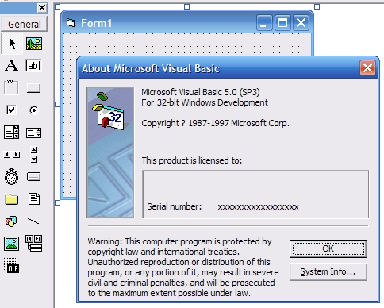

运行中的 VB5.0

**Microsoft Visual Basic 6.0**

Visual Basic 6.0作为Visual Studio 6.0的一员发布，也被称作Visual Basic 98。Visual Basic
6.0在数据访问方面有了很大的改进，新的ADO组件让对大量数据快速访问成为可能。数据环境和新的报表功能也让数据开发有了全新的体验。Visual Basic
借助COM/COM+强大的功能，可以开发具有N层结构的分布式应用程序。同时，Visual Basic
6还可以在IIS上开发性能超群的Web应用程序。Visual Basic 6.0在语言方面和IDE方面的改进都不大，但是许多新增的组件成为Visual
Basic开发人员手中的利器，如File System Object等。新的字符串函数Split和Replace等也给Visual
Basic的程序员带来很大方便。总之Visual Basic
6.0已经是非常成熟稳定的开发系统，能让企业快速建立多层的系统以及Web应用程序，成为当前Windows上最流行的Visual Basic版本。

** [ 下载 Visual Basic 6.0 代码示例](http://bihai.org/mydoc/msbasic/vb6sample.zip)** (1.5MB) 

** [ 下载 Visual Basic 6.0 sp6 英文简化版](http://bihai.org/mydoc/msbasic/VB6SimpE.zip)** (6.2MB)

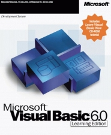

VB 6.0 学习版

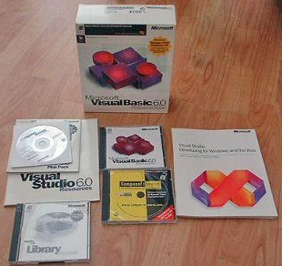

全套 VB6.0

### Microsoft Visual Basic 7.0/.NET――新的革命？

从1998年发布到2002年正式推出，Visual Basic.NET简直吊足了开发者的胃口。从2000年就开始传言的具有继承、Try…Catch语句等新功
能的全新VB7.0一直没有露面。直到2001年，Visual Studio.NET的第一个BETA版问世的时候，所有人都呆了――这 还是Visual Bas
ic吗？And语句变成了BitAnd，数组只能从0下标开始，而且连Dim语句的意义都变了，几乎所有的窗体控件都变了，Long变成了Integer而Integ
er变成了Short，Variant不见了，Static不能用了……简直是翻天覆地，人们已经无暇关注这个版本有什么改进，转而担心我怎么才能接受这个版本了。其
实Visual Basic.NET完全是为了.NET Framework这一全新的平台而设计的，Visual Basic.NET的设计者一开始没有掌握好新平
台和旧语言的平衡。到了BETA2中，很多东西回归了6.0，如BitAnd又变回了And，数组的定义语句也变回了原有的意义，Static也回到了Visual
Basic中。但是BETA1惊人的变化让所有的VB开发者怕了，他们觉得这种语言被改的千疮百孔，有些人干脆转去研究传说中的新语言C#。但是Visual
Basic.NET渡过几个BETA版本之后还是找到了正确的定位。Visual
Basic.NET有对CLR最完善的支持，同时尽量保留着BASIC易懂的语法风格和易用性。这个版本新增加的功能已经数不清，最重要的几个是：

1、继承。至此，Visual Basic完成了向面向对象转变的道路。  
2、共享成员。  
3、Try…Catch结构化异常处理。  
4、Delegate和Interface。  
5、名称空间。  
6、对自由线程的支持。  
特别的是，Visual Basic.NET大大减少了Visual Basic语言的关键字。历史是在不断重演的，Visual
Basic.NET如今的处境和当年的Visual Basic 4.0很相似， 处在微软战略大挪移的前夜。同时由于依附于.NET
Framework，程序发布造成了一定的困难。现在国内使用Visual Basic. NET的人相对于Visual Basic
6.0来讲显得很少。从种种迹象来看，这一版本注定是一个过渡，但 无论如何这是又一次革命。

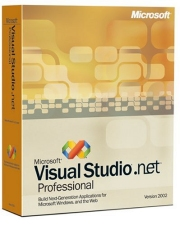

Visual Studio .net 包装盒

**Microsoft Visual Basic .Net 2003**

Visual Basic. NET 2003是一个相当稳重的版本，改变很少，但对小处有很多改进。首先Visual Basic
6.0升级向导做了很大改进，这给从老版本痛苦升级的人带来了更多一些的希望。其次在IDE方面，Visual Basic. NET
2003修正了许多错误，还让事件处理恢复了6.0的开发体验。语言方面只有两项改进：1、 在For、For Each语句中声明循环变量。  
2、 增加了数学移位运算符<<和>>。

在这个比较成熟稳定的新版本下，许多Visual Basic的爱好和开始重新了解Visual
Basic.NET，社区里面也渐渐热闹起来。但是，有些使用C#的开发者坚持认为Visual Basic.NET是垃圾，尽管Visual
Basic.NET拥有比C#更多的功能和更好的IDE。这说明不了解Visual Basic.NET成为它普及的最大障碍。

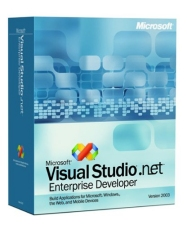

Visual Studio .net 包装盒

**Visual Basic 2005: 完美主义者的Visual Basic，一个新神话？**

终于曙光再现，在折腾了7年之后，Visual Basic 2005就要出世了。这次Visual Basic 2005光语言上的改进就足以让Visual
Basic的开发人员高兴一阵子：  
1、 泛型  
2、 运算符重载  
3、 Partial Type  
4、 窗体的默认实例（让你用VB6的语法使用窗体）  
5、 语法的多种改进  
6、 My关键字  
现在用Visual Basic 2005只要一行代码就可以读写注册表、访问文件、读写串口、获取应用程序信息
等等，而泛型、运算符重载等功能又可以让Visual Basic的开发人员深入.NET Framework的全部功能，开发出最优秀的应用 和WEB程序。

Visual Basic 2005似乎预示着Visual Basic崭新的光明前景，Visual Basic的爱好者和使用者，让我们热切期待国王归来吧!

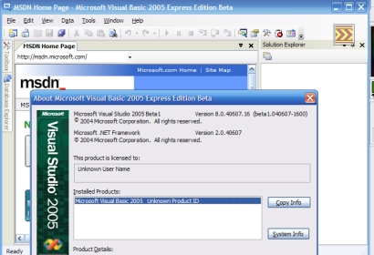

运行中的Visual Basic 2005

###  VBScript: 无所不在的脚本语言

VBScript是“Microsoft's Visual Basic Scripting Edition”的缩写，是[Visual
Basic](http://en.wikipedia.org/wiki/Visual_Basic) 的子集，主要作为广泛应用的脚本语言用于ASP网页和[Wi
ndows](http://en.wikipedia.org/wiki/Windows_Scripting_Host)脚本执行，有时也用来替代DOS批处理文
件。VBScript依赖于脚本解释程序, 不论是网页环境里的ASP、WINDOWS
环境里的wscript.exe还是命令行方式下的cscript.exe。VBscript 文件通常使用`"vbs"作为扩展名。  
MS ` [ Internet Explorer](http://en.wikipedia.org/wiki/Internet_Explorer) 中使用的
VBScript版本非常接近[JavaScript](http://en.wikipedia.org/wiki/JavaScript)[，](http://
en.wikipedia.org/wiki/JavaScript)可以嵌入HTML。然而由于它对其他浏览器而言实际上没有一点兼容性，许多网站站长更喜欢（实际
是不得不）选择[JavaScript](http://en.wikipedia.org/wiki/JavaScript)。

###  VBA: 使你的工作自动化

Visual Basic for Applications (VBA) 是Microsoft Office应用软件内建的BASIC语言实现。越来越多的软件开
始支持VBA，例如AutoCAD、WordPerfect、CorelDRAW和Visio等等。它扩充了以前的宏语言(例如WordBASIC)，并且能够用来控
制宿主程序的所有的一切，比如菜单修改和加入用户自定义的对话框和控件。正如其名，VBA是Visual Basic的近亲，但通常只能运行于宿主程序内部，而不是单
独执行。你可以用它来从外部控制程序的执行，例如自动根据Excel的数据生成Word文档。除了回调以外，VBA基本与Visual
Basic最新版本同步，而且使用Visual
Basic中的VBAx.dll。感谢微软，VBA在我的日常工作中发挥了巨大的作用，节省了我大量的时间，用来写这些连篇废话。

#### 非微软BASIC: 对面的女孩看过来

###  TurboBASIC: 昙花一现

恐怕连微软也从来没敢小视过BORLAND公司。所以当你被提醒BORLAND在推出著名的Turbo
C后不久的1987年推出了自己的BASIC编译器――TurboBASIC 1.0时， 大概也不会太惊讶。正如 BORLAND
的一贯风格，这个版本丝毫不逊色于它的微软表兄QuickBASIC,
而且在某些方面还独具特色――虽然作为qb45的老支持者我不愿承认这点。1988年，新的TurboBASIC 4.0推出，支持多文档界面，各方面也有长足进步。
然而从此以后，Borland似乎与微软达成了某种默契，突然离开了BASIC领域，转而发展PASCAL语言，并逐渐使DELPHI成为PASCAL语言的集大成者
，重新在编程工具领域成为了微软强有力的竞争对手。

** [ 下载 TurboBASIC 1.0](http://bihai.org/mydoc/msbasic/tb10.zip)** **                                [ 下载 TurboBASIC 4.0](http://bihai.org/mydoc/msbasic/tb40.zip)**

  
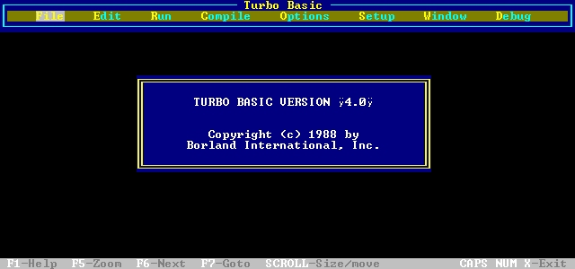

运行中的Turbo BASIC 4.0

Bob Zale――Turbo Basic和PowerBASIC 之父

###  PowerBASIC: 别样的传奇

Turbo Basic 的原型是1980年左右由Bob Zale为CP/M and MS-DOS开发的交互式编译器BASIC/Z。
由于BORLAND取消了对BASIC的支持，于是在1990年，Bob Zale――Turbo Basic和PowerBASIC
之父，最终收回了自己的产品，并独立将其发展为今天著名的PowerBASIC。
正如其名，PowerBASIC是一种“强有力”的BASIC。它的客户包括NASA(美国国家航空和宇宙航行局), Rolls
Royce(著名的豪华轿车生产厂商――劳斯莱斯)。它不需要任何运行时连接库(RUNTIME
DLLS)，它的口号是“既小又快”，它有从DOS到Windows甚至到Linux下各种适合版本，它可以编译 成为真正的内码，可以产生真正的带export的d
ll，它完全支持COM、API和OLE，它的价格只有vb6的1/10，只有vb6的1/50那么大，它生成的EXE也是如此。还有什么是你从VB中找不到的？试试
[PowerBASIC](http://PowerBASIC.com)罢。

不同版本的Power BASIC价格从25美元到最高199美元 不等。

**[ 下载 PowerBASIC 全部版本](http://bihai.org/mydoc/msbasic/pball.rar)**（16MB）
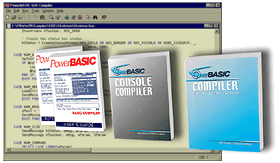

PowerBASIC 编程工具

### RealBASIC: 跨平台的选择

RealBASIC是一种跨平台的BASIC语言， 同时拥有MAC、Windows和Linux版。可以编译生成各个平台的机器内码。你可以把源代码输出为xml或
从vb工程中导入。支持OLE、COM，支持[Oracle](http://en.wikipedia.org/wiki/Oracle_database), [
PostgreSQL](http://en.wikipedia.org/wiki/PostgreSQL), [
MySQL](http://en.wikipedia.org/wiki/MySQL)等数据库 以及OOP，如果你希望进行无障碍的跨平台编程并希望最大可能减少
工作强度，RealBASIC无疑是一种非常好的[选择](http://www.realbasic.com)。

标准版：149.95美元，专业版：449.95美元

**[ 下载 RealBASIC 5.52 for Win32 专业版 ](http://bihai.org/mydoc/msbasic/pball.rar)**（15MB）

RealBASIC 工作界面

### PureBASIC: 广泛的可移植性

PureBASIC的显著特色是它广泛的可移植性。它可以在Windows, AmigaOS 和 Linux系统上流畅运行。由于支持了指针、结构、子程序和动态链
表，有经验的程序员可以毫不费力的访问系统支持的任意结构和API。更离奇的是它居然支持行内汇编――天哪。

主要特点：  
\- 600条以上的内部命令  
\- 支持所有BASIC关键字  
\- 高速编译器可产生高质量内码  
\- 不需要任何运行时库  
\- 完全结构化编程  
\- 完全系统API呼叫支持  
\- 支持DirectX和SDL  
\- 在OGRE支持下的3D  
\- 使用汇编语言来访问特定硬件  
\- 代码的完全可移植性  
\- 专业的编辑和开发环境  
\- 完整的DEBUG和跟踪工具

价格：59 欧元

**[ 下载 PureBASIC 3.51 for Win32版 ](http://bihai.org/mydoc/msbasic/pball.rar)**（4.3MB）
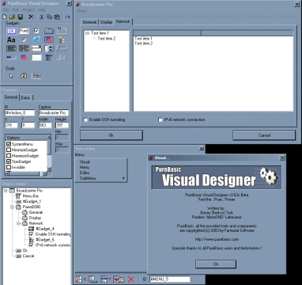

运行中的PureBASIC

### Liberty BASIC: QBasic的替身

Liberty
BASIC原意面向编程初学者，然而它的功能一点都不弱。它的特点是突出了图形功能，你可以把它当作QBasic的升级版来对待，但它的能力远不止如此。  
注意：此版本不能编译成本地内码。但据说在[sf.net](http://sourceforge.net/projects/lbpp)上有一个可以将Liber
ty BASIC翻译成c，然后再用gcc编译的工具，不知是不是真的。

价格：29.95美元

**[ 下载 Liberty BASIC 4.0 for Win32 专业版 ](http://bihai.org/mydoc/msbasic/pball.rar)**（15MB）
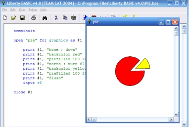

运行中的Liberty BASIC

#### 开放源代码的BASIC语言解释/编译器：创造你自己的BASIC

### XBasic: 开放源代码的BASIC语言开发系统

XBasic是使用BASIC语言的源代码开放的综合软件开发系统，包括一个高级编译器，支持Win32操作系统(Win9x,WinNT)和Linux，通过翻译B
ASIC到ASM实现编译。尽管功能可能不是太强大，但作为一个免费的包括源代码的BASIC开发系统，我们还能说什么？

最新版请浏览：http://prdownloads.sourceforge.net/xbasic/

**[ 下载 XBasic 6.2.3 for Win32](http://bihai.org/mydoc/msbasic/pball.rar)**

** [ 下载 XBasic 6.2.3 for Linux](http://prdownloads.sourceforge.net/xbasic/xbasic-6.2.3-linux-i386.tar.gz)**

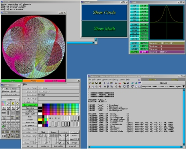

运行中的XBasic

### YABasic: 不过是另一个BASIC

Yabasic (Yet Another BASIC) 是针对Win32和Linux平台的BASIC解释器，类似于Commodore
BASIC。它能处理单色线图形并支持打印。它只有200KB这么小，甚至还有一个针对Sony Playstation 2的版本可用。

最新版请浏览：http://www.yabasic.de/

** [ 下载 YABasic 2.751 for Win32](http://bihai.org/mydoc/msbasic/yabasic-2.751.bin.exe)**

** [下载 YABasic 2.751 for Win32](yabasic-2.751.src.exe)[ 源代码](http://bihai.org/mydoc/msbasic/yabasic-2.751.src.exe)**

** [ 下载 YABasic 2.751 for Linux](http://bihai.org/mydoc/msbasic/yabasic-2.751-1.i386.rpm)**

** [ 下载 YABasic 2.751 for Linux](http://bihai.org/mydoc/msbasic/yabasic-2.751.tar.gz)**

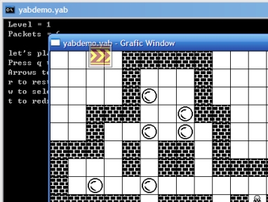

运行中的YABasic

### wxBasic: 又一个免费午餐

wxBasic是一个免费、跨平台和源代码开放的BASIC解释器。
它支持WIN32和LINUX系统。如果你把它的源代码同解释器捆绑，就会得到一个“可执行”文件。  
最新版请浏览：[wxBasic](http://wxbasic.sourceforge.net/)

** [ 下载 wxBasic 0.51 for Win32](http://bihai.org/mydoc/msbasic/yabasic-2.751.bin.exe)**

** [下载 wxBasic 0.51 for Win32](http://bihai.org/mydoc/msbasic/yabasic-2.751.src.exe)[ 源代码](http://bihai.org/mydoc/msbasic/yabasic-2.751.src.exe)**

** [ 下载 wxBasic 0.51 for Linux](http://bihai.org/mydoc/msbasic/yabasic-2.751-1.i386.rpm)**

** [ 下载 wxBasic 0.51 for Linux](http://bihai.org/mydoc/msbasic/yabasic-2.751.tar.gz)**

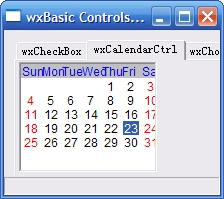

###  
其它的BASIC: 万花筒家族

**ByWater BASIC：**

[ByWater BASIC](http://www.bwbasic.com)是一个LINUX下的BASIC解释器，实现了ANSI标准的最小BASIC(X3
.60-1978)的超集，同时又是ANSI标准的全部BASIC定义(X3.113-1987)的重要子集。  
** [ 下载 wxBasic 0.51 for MS-DOS](http://bihai.org/mydoc/msbasic/BWB110E.ZIP)**

**Chipmunk Basic：**

Chipmunk Basic是一个简单的老式BASIC解释器，版本涵盖MacOS, SunOS 和
Win32，不过只有Mac版本支持图形和声音。Win32版只实现了一个文本控制台界面。  
** [ 下载 Chipmunk Basic version 3.5.9](http://bihai.org/mydoc/msbasic/w32cbas359b3.zip)**

**Rapid Q：**

Rapid-Q是一个跨平台的BASIC程序设计语言，它可以创建图形或字符界面的应用程序，包括用于网络的CGI程序。支持MySQL、DirectX、Direc
t3D、Sockets、COM，支持面向对象编程。支持Windows 95/98/NT/2000, Linux/i386, Solaris/Sparc,
和HP-UX。最重要的是它是免费的。可惜现在它的作者传说已被REALBASIC招安，也许这个工程不会再继续了。

** [下载 Rapid-Q for Win32 beta](http://bihai.org/mydoc/msbasic/rqbeta.zip)**

** [下载 ](http://bihai.org/mydoc/msbasic/rqbeta.zip) [ Rapid-Q for Linux beta](http://bihai.org/mydoc/msbasic/rqbeta.tgz)**

**Lemick Basic：**

Lemick 是一种使用与传统BASIC类似的语言进行现代程序设计工具。

** [ 下载 ](http://bihai.org/mydoc/msbasic/rqbeta.zip) [ Lemick for Linux 0.9.0alpha2](http://bihai.org/mydoc/msbasic/lemick-0.9.0a2.tar.gz)**

HBasic:

HBasic是一个支持BASIC风格语言的程序设计工具，具有解释和编译器，可以创建、执行和调试和编译。支持面向对象编程。

** [ 下载 ](http://bihai.org/mydoc/msbasic/rqbeta.zip) [ HBasic for Linux 0.9.9o](http://bihai.org/mydoc/msbasic/HBasic-0.9.9o.tar.gz)**

BASIC版本还有很多很多，我就先说到这里罢，你我的脑子都够累了。我想你 现在应该感觉到BASIC的力量了罢？拥有如此之多支持者，谁还会担心BASIC的命运
？来学编程罢，即使你从来没有接触过计算机，BASIC语言也能使你用最短的时间成为一个真正的程序员。在将来，BASIC也许无处不在。即使不用计算机，使用BAS
IC语言逻辑来处理你的日常工作和生活，不也是一大乐事吗？BASIC万岁!

注：由于网络空间问题，上面所列下载资源无法全部提供。如有需要，可以发 [ E-Mail](mailto:bihaiorg@139.com) 我:
bihaiorg@139.com。

附： 关于各种BASIC的英文简介，BASIC家族真大呀！

  * [ Altair BASIC](http://en.wikipedia.org/wiki/Altair_BASIC_programming_language) (MITS Altair, S-100;微软的第一个产品) 
  * [ Amiga BASIC](http://en.wikipedia.org/w/wiki.phtml?title=Amiga_BASIC_programming_language&action=edit) (Commodore Amiga) 
  * [ AMOS](http://en.wikipedia.org/wiki/AMOS_BASIC_programming_language) (Commodore Amiga) 
  * [ Apple Business BASIC](http://en.wikipedia.org/w/wiki.phtml?title=Apple_Business_BASIC_programming_language&action=edit) (Apple ///) 
  * [ Applesoft BASIC](http://en.wikipedia.org/wiki/Applesoft_BASIC_programming_language) (Apple II) 
  * [ ASIC](http://en.wikipedia.org/w/wiki.phtml?title=ASIC_programming_language&action=edit) (MS-DOS) 
  * [ Atari 2600 Basic Programming](http://en.wikipedia.org/w/wiki.phtml?title=Atari_2600_Basic_Programming&action=edit) (Atari 2600 视频游戏控制台) 
  * [ ATARI BASIC](http://en.wikipedia.org/wiki/Atari_BASIC) (aka Sheperdson BASIC) (Atari 8位家族) 
  * [ ATARI Microsoft BASIC II](http://en.wikipedia.org/wiki/Atari_Microsoft_BASIC_II) (Atari 8位家族) 
  * [ B32 Business Basic](http://en.wikipedia.org/wiki/B32_Business_Basic) (Data General Eclipse MV, UNIX, MS-DOS) 
  * [ BASIC09](http://en.wikipedia.org/wiki/BASIC09_programming_language) (OS-9 和 OS-9 68K，适合 6809 和 68000 CPU) 
  * [ BASICA](http://en.wikipedia.org/wiki/Microsoft_BASICA_interpreter) (高级BASIC, IBM PC的ROM内含) (也即后来PC-DOS中的磁盘版本) 
  * [ BASIC A+](http://en.wikipedia.org/wiki/BASIC_A_Plus_programming_language) (Atari 8位家族) 
  * [ BASIC-E](http://en.wikipedia.org/w/wiki.phtml?title=BASIC-E_programming_language&action=edit) (aka 'submarine BASIC') (CP/M) 
  * [ Basic Plus](http://en.wikipedia.org/wiki/Basic_Plus) ([DEC](http://en.wikipedia.org/wiki/Digital_Equipment_Corporation), 用于[RSTS/E](http://en.wikipedia.org/wiki/RSTS/E) 操作系统, [ PDP-11](http://en.wikipedia.org/wiki/PDP-11) 处理器) 
  * [ BASIC XE](http://en.wikipedia.org/w/wiki.phtml?title=BASIC_XE_programming_language&action=edit) (Atari 130XE) 
  * [ BBC BASIC](http://en.wikipedia.org/wiki/BBC_BASIC_programming_language) (Acorn/BBC Micro, RISC OS, Tiki 100, Cambridge Z88, CP/M, MS-DOS) 
  * [ Blitz Basic](http://en.wikipedia.org/wiki/Blitz_BASIC_programming_language) (Commodore Amiga, MS-DOS) 
  * [ Bxasm](http://en.wikipedia.org/wiki/Bxasm_programming_language) (Win32, 源码开放, 本地编译) 
  * [ Bywater BASIC](http://en.wikipedia.org/wiki/Bywater_BASIC_programming_language) (aka bwBASIC) (MS-DOS, POSIX) 
  * [ CBASIC](http://en.wikipedia.org/w/wiki.phtml?title=CBASIC_programming_language&action=edit) (BASIC-E 的新作) (CP/M, MS-DOS) 
  * [ Chipmunk Basic](http://en.wikipedia.org/w/wiki.phtml?title=Chipmunk_Basic_programming_language&action=edit) (Apple Macintosh, CLI Win32 移植, GNU/Linux; 有版权保护的免费版本) 
  * [ Color BASIC](http://en.wikipedia.org/w/wiki.phtml?title=Color_BASIC_programming_language&action=edit) (Tandy Radio Shack TRS-80 Color Computer, aka CoCo) 
  * [ Commodore BASIC](http://en.wikipedia.org/wiki/Commodore_BASIC_programming_language) (Commodore 8-bit family) 
  * [ Dartmouth BASIC](http://en.wikipedia.org/wiki/Dartmouth_BASIC) (see also True BASIC) 
  * [ Data General Business Basic](http://en.wikipedia.org/wiki/Data_General_Business_Basic) (Data General Nova and later DG minicomputers) 
  * [ Ethos Basic](http://en.wikipedia.org/w/wiki.phtml?title=Ethos_Game_Basic&action=edit) (MS Windows) 
  * [ Extended Color BASIC](http://en.wikipedia.org/w/wiki.phtml?title=Extended_Color_BASIC_programming_language&action=edit) (TRS-80 Color Computer) 
  * [ FutureBASIC](http://en.wikipedia.org/w/wiki.phtml?title=FutureBASIC_programming_language&action=edit) (Apple Macintosh) 
  * [ Gambas](http://en.wikipedia.org/wiki/Gambas) (GNU/Linux) (similar approach as Visual Basic) 
  * [ geoBASIC](http://en.wikipedia.org/w/wiki.phtml?title=GeoBASIC_programming_language_%28GEOS%29&action=edit) (GEOS on Commodore 64) 
  * [ GeoBASIC](http://en.wikipedia.org/w/wiki.phtml?title=GeoBASIC_programming_language_%28Leica%29&action=edit) (Leica TPS 1000/1100 surveying stations) 
  * [ GNOME Basic](http://en.wikipedia.org/wiki/Gnome_Basic) (GNU/Linux) (discontinued Visual Basic clone) 
  * [ GFA BASIC](http://en.wikipedia.org/wiki/GFA_BASIC_programming_language) (Commodore Amiga) 
  * [ GW-BASIC](http://en.wikipedia.org/wiki/Microsoft_GW-BASIC_interpreter) (MS-DOS) (BASICA compatible; independent of IBM ROM routines) 
  * [ Hbasic](http://en.wikipedia.org/wiki/Hbasic) (GNU/Linux) (similar approach as Visual Basic) 
  * [ HotPaw Basic](http://en.wikipedia.org/w/wiki.phtml?title=HotPaw_Basic_programming_language&action=edit) (aka yBasic, nee cbasPad Pro) (PalmOS) 
  * [ IBasic](http://en.wikipedia.org/wiki/IBASIC_programming_language) (MS Windows) 
  * [ Integer BASIC](http://en.wikipedia.org/wiki/Integer_BASIC_programming_language) (Apple II) 
  * [ Liberty BASIC](http://en.wikipedia.org/wiki/Liberty_BASIC_programming_language) (MS Windows) 
  * [ Locomotive BASIC](http://en.wikipedia.org/wiki/Locomotive_BASIC_programming_language) (Amstrad CPC) 
  * [ LotusScript](http://en.wikipedia.org/wiki/LotusScript_programming_language) (Lotus Notes) 
  * [ MAI Basic Four Business Basic](http://en.wikipedia.org/w/wiki.phtml?title=MAI_Basic_Four_Business_Basic&action=edit) (misc. minicomputers) 
  * [ Mallard BASIC](http://en.wikipedia.org/w/wiki.phtml?title=Mallard_BASIC_programming_language&action=edit) (Amstrad PCW, CP/M on ZX Spectrum +3) 
  * [ Microsoft BASIC](http://en.wikipedia.org/wiki/Microsoft_BASIC) (overview of Microsoft BASIC variants) (many microcomputer platforms) 
  * [ MBASIC](http://en.wikipedia.org/w/wiki.phtml?title=Microsoft_MBASIC_programming_language&action=edit) (Microsoft BASIC for CP/M) 
  * [ MSX BASIC](http://en.wikipedia.org/wiki/MSX_BASIC_programming_language) (MSX) 
  * [ Northstar BASIC](http://en.wikipedia.org/w/wiki.phtml?title=Northstar_BASIC_programming_language&action=edit) (Processor Technology, Northstar, later adapted to [ x86](http://en.wikipedia.org/wiki/X86) as Bazic '86) 
  * [ Phoenix Object Basic](http://en.wikipedia.org/wiki/Phoenix_Object_Basic_programming_language) (GNU/Linux) 
  * [ PowerBASIC](http://en.wikipedia.org/wiki/PowerBASIC_programming_language) (successor of Turbo BASIC) (MSDOS, Win32) 
  * [ PureBasic](http://en.wikipedia.org/wiki/PureBasic_programming_language) (Win32, GNU/Linux and Commodore Amiga) 
  * [ QBASIC](http://en.wikipedia.org/wiki/QBASIC_programming_language) (MS-DOS) 
  * [ QuickBASIC](http://en.wikipedia.org/wiki/Quick_BASIC_programming_language) (MS-DOS) 
  * [ RapidQ](http://en.wikipedia.org/wiki/RapidQ_programming_language) (Cross-platform, free) 
  * [ REALbasic](http://en.wikipedia.org/wiki/REALBASIC_programming_language) (Apple Macintosh, Win32) 
  * [ Revelation Basic](http://en.wikipedia.org/wiki/Revelation_BASIC_programming_language) (MS-DOS) 
  * [ SAM BASIC](http://en.wikipedia.org/w/wiki.phtml?title=SAM_Basic_programming_language&action=edit) (Sam Coupé) 
  * [ ScriptBasic](http://en.wikipedia.org/wiki/ScriptBasic_programming_language) (Win32 and GNU/Linux) (released under the [ Lesser General Public License](http://en.wikipedia.org/wiki/Lesser_General_Public_License) aka LGPL) 
  * [ Sharp BASIC](http://en.wikipedia.org/w/wiki.phtml?title=Sharp_BASIC_programming_language&action=edit) (Sharp pocket computers) 
  * [ Sinclair BASIC](http://en.wikipedia.org/wiki/Sinclair_BASIC_programming_language) (ZX80, ZX81/TS1000, ZX Spectrum) 
  * [ SmallBASIC](http://en.wikipedia.org/wiki/SmallBASIC_programming_language) (GNU/Linux, MS-DOS, Win32, PalmOS; GPL) 
  * [ SmartBASIC](http://en.wikipedia.org/w/wiki.phtml?title=SmartBASIC_programming_language&action=edit) (Coleco Adam) 
  * [ ST BASIC](http://en.wikipedia.org/w/wiki.phtml?title=ST_BASIC_programming_language&action=edit) (Atari ST) 
  * [ StarOffice Basic](http://en.wikipedia.org/wiki/StarOffice_Basic) (aka StarBasic) (OpenOffice, StarOffice) 
  * [ STOS BASIC](http://en.wikipedia.org/w/wiki.phtml?title=STOS_BASIC_programming_language&action=edit) (Atari ST) 
  * [ SuperBasic](http://en.wikipedia.org/w/wiki.phtml?title=SuperBasic_programming_language&action=edit) (Sinclair QL) 
  * [ THEOS Multi-User Basic](http://en.wikipedia.org/wiki/THEOS_Multi-User_Basic_programming_language)
  * [ TI-BASIC](http://en.wikipedia.org/wiki/TI_BASIC_programming_language_\(calc\)) (Texas Instruments programmable calculators) 
  * [ TI BASIC](http://en.wikipedia.org/wiki/TI_BASIC_programming_language_\(TI_99/4A\)) (Texas Instruments TI 99/4A) 
  * [ TI Extended BASIC](http://en.wikipedia.org/w/wiki.phtml?title=TI_Extended_BASIC_programming_language&action=edit) (ditto) 
  * [ Tiny BASIC](http://en.wikipedia.org/wiki/Tiny_BASIC_programming_language) (any microcomputer, but mostly implemented on early S-100 machines) 
  * [ TRS-80 Level I BASIC](http://en.wikipedia.org/w/wiki.phtml?title=TRS-80_Level_I_BASIC_programming_language&action=edit) (TRS-80) (based on TinyBASIC) 
  * [ TRS-80 Level II BASIC](http://en.wikipedia.org/w/wiki.phtml?title=TRS-80_Level_II_BASIC_programming_language&action=edit) (TRS-80) 
  * [ True BASIC](http://en.wikipedia.org/wiki/True_BASIC_programming_language) (MS-DOS, MS Windows, Apple Macintosh) 
  * [ Turbo BASIC](http://en.wikipedia.org/wiki/Turbo_BASIC_programming_language) (successor of BASIC/Z) (see PowerBASIC) 
  * [ VBScript](http://en.wikipedia.org/wiki/VBScript_programming_language) (MS ASP, MS Windows with WSH) 
  * [ Visual Basic](http://en.wikipedia.org/wiki/Visual_Basic_programming_language) (MS Windows) 
  * [ Visual Basic .NET](http://en.wikipedia.org/wiki/Visual_Basic_.NET) (MS Windows) 
  * [ Visual Basic for Applications (VBA)](http://en.wikipedia.org/wiki/Visual_Basic_for_Applications_programming_language) (MS Office on MS Windows and Apple Macintosh) 
  * [ Watcom Basic](http://en.wikipedia.org/w/wiki.phtml?title=Watcom_Basic&action=edit)
  * [ WordBasic](http://en.wikipedia.org/w/wiki.phtml?title=WordBasic_programming_language&action=edit) (pre-VBA MS Office versions) 
  * [ wxBasic](http://en.wikipedia.org/wiki/WxBasic) (BASIC interpreter using [ wxWidgets](http://en.wikipedia.org/wiki/WxWidgets)
  * [ XBasic](http://en.wikipedia.org/wiki/XBasic_programming_language) (Win32, GNU/Linux) (GPL) 
  * [ YaBasic](http://en.wikipedia.org/wiki/YaBasic_programming_language) (Win32, GNU/Linux, Playstation 2) (GPL)

